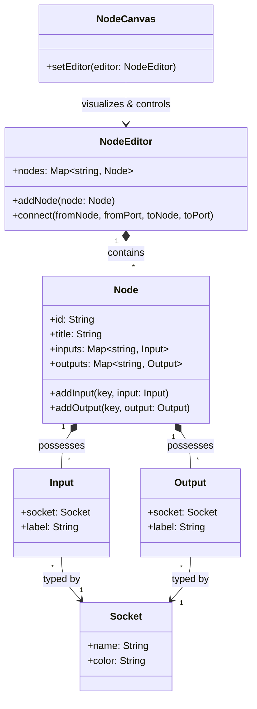

[](https://opensource.org/licenses/MIT)
[](https://nodejs.org)
[](#)
[](#)

# symbiote-node

A **visual node graph editor** and **execution engine** built on [Symbiote.js](https://github.com/symbiotejs/symbiote.js) — extensible, themeable, zero-dependency. Pure Web Components, works anywhere: vanilla HTML, React, Vue, Svelte, or any framework that supports custom elements.

> [!TIP]
> **Node-safe core, browser Web Components, and agent-readable metadata.** Clone, serve, and start building node graphs in under a minute.

---

## Table of Contents

- [Graph Editor](#graph-editor)
- [Universal Graph Model](#universal-graph-model)
- [Source Display and Editing](#source-display-and-editing)
- [List UI](#list-ui)
- [Surface UI](#surface-ui)
- [Tree UI](#tree-ui)
- [Chat UI](#chat-ui)
- [Experimental HTML-in-Canvas Renderer](#experimental-html-in-canvas-renderer)
- [Experimental WebXR Provider](#experimental-webxr-provider)
- [Shared UI Styles](#shared-ui-styles)
- [Localization](#localization)
- [Execution Engine](#execution-engine)
- [Node Shapes](#node-shapes)
- [Theme System](#theme-system)
- [Runtime UI Registry](#runtime-ui-registry)
- [Layout System (BSP)](#layout-system-bsp)
- [Plugins & Interactions](#plugins--interactions)
- [Compatibility Matrix](#compatibility-matrix)
- [Installation](#installation)
- [Quick Start](#quick-start)
- [As ES Module (CDN)](#as-es-module-cdn)
- [CLI (Engine)](#cli-engine)
- [Agent Provider Contract](#agent-provider-contract)
- [Engine Handlers](#engine-handlers)
- [Project Structure](#project-structure)
- [Tests](#tests)
- [Related Projects](#related-projects)
- [License](#license)

---

## Compatibility Matrix

`symbiote-node` is designed to be highly compatible across modern browser environments and server-side runtime setups.

| Environment | Supported Version / Status | Notes |
|-------------|----------------------------|-------|
| **Node.js** | `>= 18.0.0` | Required for topological engine execution and CLI tool |
| **Browsers** | Modern evergreen browsers (Chrome, Safari, Firefox, Edge) | Native custom elements, CSS custom properties, and SVG rendering |
| **SSR / Server Rendering** | Full isomorphic safety (Next.js, Nuxt, SvelteKit, etc.) | Core classes run on server; UI components are inert until browser hydration |
| **Symbiote.js** | `>= 3.0.0` | Peer dependency for reactive custom elements |

---

### Graph Editor

The editor constructs visual node graphs from a data model. Nodes have typed input/output ports with compatibility validation, color-coded category headers, inline controls, and drag & drop with snap-to-grid. Connections render as SVG Bézier curves with gradient coloring.

```javascript
import { NodeEditor, Node, Socket, Input, Output } from 'symbiote-node';
import { NodeCanvas } from 'symbiote-node/ui';

const editor = new NodeEditor();
const socket = new Socket('data', { color: '#4a9eff' });

const node1 = new Node('Source', { category: 'server' });
node1.addOutput('out', new Output(socket, 'Output'));

const node2 = new Node('Target', { category: 'control' });
node2.addInput('in', new Input(socket, 'Input'));

editor.addNode(node1);
editor.addNode(node2);

const canvas = document.querySelector('node-canvas');
canvas.setEditor(editor);
```

### Core Architecture Relationship



The root `symbiote-node` entrypoint is Node-safe and does not register browser custom elements. Browser UI modules live in `symbiote-node/ui`; in SSR or pure Node imports, browser-only exports are present but resolve to `undefined` until DOM globals are available.

### Universal Graph Model

`symbiote-node/graph` exposes Node-safe graph normalization for project data, UI layouts, automation workflows, media pipelines, and external node-workflow formats. `graph-model-v1` keeps node flow, params, design, hierarchy, state, views, and theme references as separate data domains so host apps and agents can project the same model into editors, dashboards, runtime execution, or custom layouts without product-specific fields.

```javascript
import { graphModelToCanvasGraphModel, normalizeGraphModel } from 'symbiote-node/graph';

const model = normalizeGraphModel({
  version: 'graph-model-v1',
  nodes: [
    {
      id: 'panel:queue',
      kind: 'ui.panel',
      params: { source: 'automation.queue' },
      design: { component: 'sn-list-item', themeScope: 'panel.queue' },
    },
  ],
});

const canvasModel = graphModelToCanvasGraphModel(model, { view: 'main' });
```

`project-package-v1` wraps those graphs with layouts, themes, packs, data sources, and agent rules. A host application can load a package config and choose the entry graph, layout, and theme without hardcoding a product shell. Built-in provider themes validate modifier names against the published theme controls so agent-authored packages cannot silently invent unsupported theme knobs.

`project-transaction-v1` describes safe agent-authored mutations such as adding graph nodes, connecting edges, adding runtime panels, updating a layout node, replacing a layout root, or setting a theme modifier. Hosts can apply those transactions to project packages and re-render without restarting the application.

`createProjectRuntime(project)` wraps a normalized project package with a small subscription-based host state. It applies `project-transaction-v1` updates, exposes the active graph/layout/theme records, and rejects transactions targeting a different project. Use `layout.updateNode` or `updateLayoutNode()` for focused runtime UI edits such as XR geometry changes; it only accepts `layout.rect`, `layout.weight`, `props`, and `attrs` patches. Keep `layout.setRoot` for larger structural replacements. Product apps remain responsible for persistence, permissions, and route policy.

Canvas adapters bridge the universal graph contract to the existing `CanvasGraph` model shape. They are generic: product skeletons, route state, code-analysis metadata, and server policy stay in the host or provider layer. `buildFileGraph()`, `buildStructuredGraph()`, `buildGraphModelFromSkeleton()`, and `buildCanvasGraphModelFromSkeleton()` are public `symbiote-node/graph` helpers for projecting code skeleton data through provider graph contracts before a host renders it.

Project graph build helpers are also Node-safe provider data utilities. `buildFlatGroups()` combines directory groups with optional semantic cluster metadata, `prepareGraphBuild()` coordinates cached flat/structured graph builders supplied by a host, and `buildGraphStatItems()` returns display-neutral stat rows. Host panels such as Agent Portal's dependency graph should consume these helpers from `symbiote-node/graph` instead of keeping parallel grouping and stat-shaping logic in product UI files.

Project graph metadata is normalized and validated by the provider as well. Use `normalizeProjectGraphMetadata()` for permissive read-side cleanup and `validateProjectGraphMetadata()` before persisting user- or agent-authored `.portal/project-graph.json` data. Cluster colors accept hex values or published Symbiote graph token references such as `var(--sn-graph-cluster-4)`.

Graph explorer route and focus helpers are provider-owned as well. `symbiote-node/ui` exposes `buildFlatPathHash()`, `resolveFlatHashChange()`, `getGraphHashNavigationState()`, `shouldRestoreFlatFocus()`, and related selection helpers so hosts can keep graph route synchronization and focus restoration behavior consistent without local wrapper modules.

Graph algorithm helpers such as `resolveSymbolFile()` and `findConnectionPath()` live in `symbiote-node/graph`. Hosts should use them for symbol-to-file resolution and shortest connection path highlighting instead of duplicating traversal logic in product panels.

### Source Display And Editing

`CodeBlock`, `SourceViewer`, and `SourceEditor` are reusable browser-only modules from `symbiote-node/ui`. Host applications provide file loading and persistence; the library owns rendering, markdown/code display, editable source text state, dirty state, readonly/disabled behavior, focus helpers, and tab insertion.

```javascript
import { SourceEditor, SourceViewer } from 'symbiote-node/ui';

const editor = document.querySelector('source-editor');
editor.setContent('# Notes');
editor.addEventListener('source-editor-input', (event) => {
  saveDraft(event.detail.value);
});

const viewer = document.querySelector('source-viewer');
viewer.showFile({ path: 'README.md', raw: editor.getContent(), lang: 'md' });
```

### List UI

`ListItem` is a generic browser-only list primitive from `symbiote-node/ui`. It owns neutral item presentation, active/disabled state, keyboard selection, and the `sn-list-item-select` event; host applications decide routing, persistence, and item-specific actions.
`ListDetailShell` is a generic two-pane list/detail shell. It owns split geometry, responsive stacking, empty/detail visibility, and theme aliases; host applications provide list rows, detail content, loading states, commands, and selection policy through slots.

```javascript
import { ListDetailShell, ListItem } from 'symbiote-node/ui';

const item = document.querySelector('sn-list-item');
item.setItem({
  label: 'Build',
  description: 'Run the default build task',
  icon: 'play_arrow',
  meta: 'local',
  active: false,
});

item.addEventListener('sn-list-item-select', (event) => {
  runItem(event.detail.item);
});

document.querySelector('sn-list-detail-shell').hasDetail = true;
```

### Surface UI

`SurfaceCard`, `ActionButton`, `FormField`, `StatusBadge`, `MetricItem`, `StatusBanner`, and `EmptyState` are generic browser-only composition primitives from `symbiote-node/ui`. They own the standard card background, border, radius, spacing, action control variants, form label/control geometry, compact status label variants, label/value metric rows, inline status feedback, empty placeholder layout, keyboard activation, and interactive hover/focus states. Host applications keep content, native input data, validation, status mapping, and command policy product-specific.

```javascript
import { ActionButton, EmptyState, FormField, MetricItem, StatusBadge, StatusBanner, SurfaceCard } from 'symbiote-node/ui';

document.body.innerHTML = `
  <sn-card interactive>
    <span slot="title">Runtime</span>
    <sn-field>
      <label>Filter</label>
      <input type="search" placeholder="Search instances">
    </sn-field>
    <p>3 active instances</p>
    <sn-badge variant="success">Connected</sn-badge>
    <sn-metric><span slot="label">Latency</span><span slot="value">42ms</span></sn-metric>
    <sn-banner variant="info">Runtime status updated</sn-banner>
    <sn-empty-state>No archived instances</sn-empty-state>
    <sn-button slot="footer" variant="primary">Refresh</sn-button>
  </sn-card>
`;
```

### Tree UI

`TreeView` is a generic browser-only tree primitive from `symbiote-node/ui`. It owns neutral tree rendering, selection, expansion state, branch-aware filtering, optional expanded-state persistence, and drag payload events. `TreePanel` wraps that primitive with standard filter, collapse, and placeholder chrome for application sidebars. Host applications provide data, routing, file loading, and persistence policy.

```javascript
import { TreePanel, TreeView } from 'symbiote-node/ui';

const tree = document.querySelector('sn-tree-view');
const panel = document.querySelector('sn-tree-panel');

tree.setItems([
  {
    id: 'src',
    label: 'src',
    kind: 'folder',
    icon: 'folder',
    path: '/src',
    children: [
      {
        id: 'src-app',
        label: 'app.js',
        kind: 'file',
        icon: 'code',
        path: '/src/app.js',
        badges: ['js'],
        draggable: true,
        payload: { path: '/src/app.js' },
      },
    ],
  },
]);

tree.expandedIds = ['src'];
tree.filterText = 'app';
tree.addEventListener('sn-tree-select', (event) => {
  openItem(event.detail.item);
});

panel.setItems(tree.items);
panel.addEventListener('sn-tree-panel-filter', (event) => {
  saveFilterPreference(event.detail.filterText);
});
```

### Chat UI

Reusable chat primitives are browser-only exports from `symbiote-node/ui`. `ChatTranscript` owns transcript rendering, scroll controls, live status, copy feedback, and delegation-card events. `ChatComposer` owns the textarea, context chips, footer controls, send/stop affordance, drag/drop host, and autocomplete container. `ChatList` and `ChatListItem` own reusable chat-list display, filters, nesting, selection, creation, and delete events. Host applications keep transport, routing, persistence, autocomplete data, and model/provider policy.

```javascript
import { ChatComposer, ChatList, ChatTranscript, buildChatMessageItems } from 'symbiote-node/ui';

const transcript = document.querySelector('chat-transcript');
const { items } = buildChatMessageItems(messages, { hasActiveStream: true });

transcript.setMessageItems(items);
transcript.addEventListener('delegation-card-open', (event) => {
  openChat(event.detail.chatId);
});

const composer = document.querySelector('chat-composer');
composer.setFooterHtml(providerControlsHtml);
composer.addEventListener('chat-composer-submit', () => sendMessage(composer.getInputElement().value));

const list = document.querySelector('chat-list');
list.setItems(chatItems);
list.addEventListener('chat-list-select', (event) => openChat(event.detail.id));
```

### Experimental HTML-in-Canvas Renderer

`symbiote-node/ui` exposes an experimental HTML-in-Canvas adapter for packaged Chromium hosts and origin-trial browsers. It feature-detects `drawElementImage`, `captureElementImage`, `texElementImage2D`, `copyElementImageToTexture`, `requestPaint`, OffscreenCanvas support, paint changed-elements data, and the `layoutsubtree` canvas setup before rendering, and keeps `dom-overlay` as the fallback path when the browser does not support the API.

```javascript
import {
  createHtmlInCanvasAdapter,
  setupHtmlInCanvas,
} from 'symbiote-node/ui';

let adapter = createHtmlInCanvasAdapter();
if (adapter.canRender('canvas2d')) {
  setupHtmlInCanvas(canvas);
  canvas.addEventListener('paint', () => {
    adapter.draw2d(ctx, element, { x: 0, y: 0 });
  });
}
```

Hosts should keep this renderer behind capability checks. The default browser path remains regular Web Components and DOM overlays until the platform API is stable across target runtimes.

### Experimental WebXR Provider

`symbiote-node/xr` exposes Node-safe WebXR provider helpers for host applications that want to place project layouts in immersive browser sessions. The provider does not depend on Three.js, Babylon, PlayCanvas, or Agent Portal; it owns capability detection, session wrappers, spatial panel projection, and pointer normalization.

```javascript
import {
  createXRHtmlCanvasRenderer,
  createXRHtmlCanvasDiagnostics,
  createXRDeepGraphDiagnostics,
  createXRDeepGraphPreview,
  createXRDeepGraphPreviewOverlay,
  createXRDeepGraphPreviewSummary,
  createXRDeepGraphScene,
  createXRProjectDeepGraphProjection,
  adjustXRPanelPoseForComfort,
  adjustXRPanelRotationForViewer,
  createXRPanelHost,
  createXRPanelContentViewport,
  createXRPanelFacingSummary,
  createXRPanelGeometrySummary,
  createXRPanelFrame,
  createXRPanelPoseComfortSummary,
  createXRPanelTextureQualitySummary,
  createXRTextureQualityPolicy,
  createXRSceneGeometrySummary,
  createXRReadinessSummary,
  createXRSceneQualitySummary,
  createXRSceneController,
  createXRDomPanelWorkbench,
  createXRSpatialScene,
  createXRSpatialWorkbenchSummary,
  createXRThemeSnapshot,
  createXRWorkbenchDiagnosticPayload,
  createXRWebGLLayerTarget,
  createWebXREmulationAdapter,
  hitTestXRPanels,
  hitTestXRPanelFrame,
  selectPrimaryXRInputSource,
  createXRPointerEvent,
  createXRLayoutTransactionFromPanelPose,
} from 'symbiote-node/xr';

let scene = createXRSpatialScene(layoutTree, {
  themeScope: 'section.graph',
  userSpace: { eyeHeight: 1.62, comfortRadius: 2 },
});
let themeSnapshot = createXRThemeSnapshot(document.documentElement, {
  themeScope: scene.themeScope,
});
let controller = createXRSceneController();
let host = createXRPanelHost({
  componentResolver: (name) => name,
});
let renderer = createXRHtmlCanvasRenderer();
let panelWorkbench = createXRDomPanelWorkbench({
  document,
  panelHost: host,
  sourcePanelHost: createXRPanelHost({ componentResolver: (name) => name }),
  htmlCanvasRenderer: renderer,
});
let diagnostics = createXRHtmlCanvasDiagnostics(renderer.getSupport());
let layerTarget = await createXRWebGLLayerTarget({
  document,
  hostElement: document.body,
});

controller.setScene(scene, { themeSnapshot });
host.setScene(scene, { themeSnapshot });
panelWorkbench.setScene(scene, { themeSnapshot });
await controller.start('immersive-vr', {
  optionalFeatures: ['local-floor', 'hand-tracking'],
  canvas: layerTarget.canvas,
  gl: layerTarget.gl,
});

for (let panel of scene.panels) {
  let preview = panelWorkbench.mountPreviewPanel(panel, {
    renderCanvasPreview: panel.id === scene.panels[0].id,
  });
  let adjusted = adjustXRPanelPoseForComfort(panel, { userSpace: scene.userSpace });
  let facingAdjusted = adjustXRPanelRotationForViewer(adjusted, { userSpace: scene.userSpace });
  let viewport = createXRPanelContentViewport(panel);
  let quality = createXRPanelTextureQualitySummary(panel);
  let comfort = createXRPanelPoseComfortSummary(panel, { eyeHeight: scene.userSpace.eyeHeight });
  let facing = createXRPanelFacingSummary(facingAdjusted);
  let summary = createXRPanelGeometrySummary(facingAdjusted);
  console.log(diagnostics.mode, preview.prepared?.mode, summary.sizeSource, summary.relativeRect, summary.meters, viewport, quality, comfort, facing, facingAdjusted.rotationAdjustment);
}

let sceneQuality = createXRSceneQualitySummary(scene, {
  eyeHeight: scene.userSpace.eyeHeight,
});
let sceneGeometry = createXRSceneGeometrySummary(scene, {
  eyeHeight: scene.userSpace.eyeHeight,
});
let readiness = createXRReadinessSummary({
  launchGate: controller.getState?.().launchGate,
  htmlCanvas: diagnostics,
  sceneQuality,
});
let workbench = createXRSpatialWorkbenchSummary({
  panels: scene.panels,
  scene,
  readiness,
  themeSnapshot,
});
let diagnosticPayload = createXRWorkbenchDiagnosticPayload({
  event: 'xr-session-check',
  pageUrl: location.href,
  secureContext: window.isSecureContext,
  navigatorXr: Boolean(navigator.xr),
  readiness,
});
console.log(sceneQuality.status, sceneGeometry.minPixelsPerMeter, sceneGeometry.comfortWarningCount, sceneGeometry.facingWarningCount, readiness.status, workbench.mode, diagnosticPayload.version);

let hit = hitTestXRPanels(controllerRay, scene.panels);
let event = createXRPointerEvent(hit, { source: 'xr-controller', primary: true }, 'click');
host.dispatchPointerEvent(event);

let deepGraph = createXRDeepGraphScene(graphModel);
let deepGraphDiagnostics = createXRDeepGraphDiagnostics(deepGraph, {
  focusNodeId: 'src/index.js',
});
let deepGraphPreview = createXRDeepGraphPreview(deepGraph, {
  focusNodeId: 'src/index.js',
  pixelsPerMeter: scene.preview.pixelsPerMeter,
  eyeHeight: scene.userSpace.eyeHeight,
});
let deepGraphPreviewSummary = createXRDeepGraphPreviewSummary(deepGraphPreview);
let deepGraphOverlay = createXRDeepGraphPreviewOverlay(deepGraphPreview, {
  document,
  focusNodeId: 'src/index.js',
});
console.log(deepGraphDiagnostics.edgeCount, deepGraphDiagnostics.edgeTypes, deepGraphDiagnostics.focus, deepGraphPreviewSummary.status, deepGraphPreviewSummary.focus, deepGraphOverlay.ok);

let projectDeepGraph = createXRProjectDeepGraphProjection(projectSkeleton, {
  metadata: projectGraphMetadata,
  focusPath: 'src/index.js',
});
console.log(projectDeepGraph.graphModel.version, projectDeepGraph.scene.version, projectDeepGraph.diagnostics.focusNodeId);
```

`createXRDomPanelWorkbench()` composes the live `XRPanelHost`, the source `XRPanelHost`, and the HTML-in-Canvas renderer. It creates DOM preview shells, mounts the real component subtree, prepares the matching texture source, and can prepare lower-level XR layer sources without host-local glue. Host apps still provide component and props resolvers, route state, persistence, permissions, and diagnostic transport.

Host apps remain responsible for renderer choice. A Quest-style browser host can render projected live DOM panels as WebGL/WebGPU textures through the HTML-in-Canvas adapter, or fall back to DOM overlays while keeping the same layout, session lifecycle, theme snapshot, and pointer contracts. XR material aliases such as `--sn-xr-panel-bg` and `--sn-xr-pointer-color` derive from the default provider theme instead of defining a separate XR palette.

For hosts that already use Three.js, `symbiote-node/xr` also exposes an optional adapter and render host. The package does not import or bundle Three.js; the host supplies the runtime module while Symbiote owns renderer, camera, scene decoration, session lifecycle, controller rays, and diagnostics:

```javascript
import * as THREE from 'three';
import {
  createXRThreeHtmlCanvasTextureResolver,
  createXRThreePanelTextureBridge,
  createXRThreeRenderHost,
  createXRThreeSessionController,
  createXRThreeSessionOptions,
  createXRThreeWebXRAdapter,
} from 'symbiote-node/xr';

let textureResolver = createXRThreeHtmlCanvasTextureResolver({
  THREE,
  document,
  htmlCanvasRenderer: renderer,
});
let textureBridge = createXRThreePanelTextureBridge({
  htmlCanvasRenderer: renderer,
  getPanelElement: (panelId) => host.getPanelElement(panelId),
  textureResolver: textureResolver.resolve,
});
let adapter = createXRThreeWebXRAdapter({ THREE });
let renderHost = createXRThreeRenderHost({
  THREE,
  adapter,
  hostElement: document.body,
});
let sessionController = createXRThreeSessionController({
  globalThis,
  adapter,
  scene,
});
let target = renderHost.ensureTarget({ scene });
adapter.setScene(scene, {
  textureBridge,
  textureOptions: { requireTextureUpload: false },
});
renderHost.startLoop({
  target,
  onFrame: () => {},
});

await sessionController.start('immersive-vr', {
  target,
  ...createXRThreeSessionOptions('immersive-vr', { domOverlayRoot: document.body }),
});
console.log(textureBridge.getState(), renderHost.getDiagnostics(), sessionController.getDiagnostics());
```

`node engine/cli.js discover` reports this as the `three-webxr` renderer with an optional `host-supplied` dependency. Product demos should use this adapter and render host instead of duplicating renderer setup, panel placement, render loop ownership, controller-ray hit testing, panel material state updates, and ray-plane drag math in the host app. `createXRThreeRenderHost()` owns renderer sizing, camera updates, scene decoration, non-immersive `setAnimationLoop()` wiring, and render-loop diagnostics through `startLoop()` / `stopLoop()`. `updateXRThreePanelMaterialStates()` applies hover, selected, and dragging material colors from provider theme snapshots and session diagnostics to both panel materials and provider frame visuals without exposing product-local Three color mutation logic. Three panel meshes also include provider-owned frame visuals for the header move zone, edge/corner resize handles, and action slots when the supplied Three runtime supports mesh primitives. Controller hits also carry provider `frameTarget` data from `hitTestXRPanelFrame()`, so headset telemetry can distinguish content hover, header move, resize handles, and action slots before a host persists any geometry transaction.

`createXRThreePanelTextureBridge()` connects the provider HTML-in-Canvas renderer to Three panel materials without making Three or the experimental browser API a base dependency. The bridge prepares mounted DOM panel elements, classifies each texture source with `createXRPanelTextureSourceSummary()`, applies a Three texture when available, and records `html-in-canvas`, `provider-material-fallback`, or `unsupported` diagnostics. `createXRThreeHtmlCanvasTextureResolver()` is the provider-owned resolver for the common Three path: it renders the already mounted live DOM panel into an HTML-in-Canvas preview canvas, creates or updates a host-supplied `THREE.CanvasTexture`, applies linear filtering, sRGB color-space hints, mipmap policy, and optional anisotropy, then exposes data-only resolver diagnostics. `createXRTextureQualityPolicy(panel, options)` owns texture DPR, max texture size, pixels-per-meter thresholds, redraw mode, and capped texture dimensions. The Three resolver uses that policy with target-density sizing by default and dirty redraw, so a panel texture is uploaded only when its source key or size changes. Hosts can pass `preferTargetDensity: false` only when they deliberately want the minimum readable density. `createXRTextureDebugModeSummary()` normalizes explicit headset diagnostic modes into `requireTextureUpload`, `hideStrictTextureFailures`, and fallback flags so hosts do not duplicate strict/fallback policy. `createXRTextureGateSummary()` accepts the bridge records plus resolver state and reports both `bridgeStages` and `resolverStages`, so headset logs can distinguish missing browser support from a failed Three texture resolver. Hosts can still provide a custom texture resolver when they own a renderer-specific upload path. Pass `requireTextureUpload: true` and `hideStrictTextureFailures: true` only in explicit strict diagnostics or headset validation modes; this makes missing HTML-in-Canvas paths fail fast instead of showing material fallback panels. Normal hosts should keep the DOM/material fallback path visible.

`createXRThreeControllerRayAdapter({ THREE, dragResponse })` uses Three's XR controller target-ray flow and publishes drag response diagnostics for smoothing, deadzone, max step, raw delta, and applied delta. `selectPrimaryXRInputSource(inputSources, options)` keeps controller, hand, gaze, and screen inputs from competing by choosing one primary pointer source from WebXR `targetRaySpace`, `gripSpace`, hand, gamepad, handedness, and profile metadata. `createXRThreeSessionOptions(mode, options)` builds the provider-owned WebXR session option set for Three hosts, including the VR/AR reference space choice, optional feature negotiation, and optional DOM overlay root. `createXRThreeSessionController()` also attaches optional provider-owned controller ray visuals and panel hit reticles when the supplied Three runtime includes the needed primitives, and it reports hover, selected, dragging, and interaction event state. Three select events start ray-plane drag only when provider `frameTarget.operation` is `move` or `resize`; content hits stay selection events so hosts can route UI clicks without accidentally moving the panel. Move targets update world-space panel position; resize targets update meter size through provider frame handles and report the new size in the final pose. `createXRLayoutTransactionFromPanelPose(details, options)` turns a finished Three world-space drag pose into a `layout.updateNode` transaction that persists `props.xr.position`, `props.xr.rotation`, and `props.xr.size`; `createXRSpatialScene()` reads the same `props.xr` data on the next projection pass. `createXRThreeSessionTelemetrySnapshot(diagnostics, options)` turns those diagnostics into a stable data-only telemetry payload for server logs, headset smoke tests, and public demos, including aggregated texture quality counts, warning codes, recommendation codes, prioritized action codes, and the primary next recommendation from panel texture bridge records. `createXRThreeSessionHealthSummary(telemetry, options)` classifies the same data as `healthy`, `warning`, `waiting`, or `blocked`, with explicit checks for frames, panels, panel frame visuals, texture quality, controllers, ray visuals, hit reticle, hover, FPS, and session errors. `createXRThreeSessionWatchdogSummary(diagnostics, options)` classifies delayed session startup and running sessions that still have no XR frames without owning host timers. `createXRThreeDiagnosticPayload(options)` composes telemetry, health, launch gate, HTML-in-Canvas, texture, scene quality, readiness, and redacted URL data into a standard data payload while leaving transport and storage to the host. `createXRThreeDiagnosticTimelineSummary(events, options)` normalizes recent diagnostic events into compact data/text summaries for headset debugging panels without product-specific labels. `createXRThreeDiagnosticServerSummary(summary, options)` extracts the current client, latest clients, server-side session checks, timeline summaries, and active texture/readiness diagnostics from a provider-shaped diagnostic summary without dictating host UI labels. `createXRThreeTroubleshootingSummary(summary, options)` turns that server summary into stable issue codes such as `no-xr-frames`, `panel-frame-visuals-missing`, `texture-gate-blocked`, `input-controllers-missing`, `controller-rays-missing`, and `interaction-events-missing`, so headset demos can show one high-signal diagnosis while retaining the raw metrics. Hosts can tune `dragResponse`, `controllerRayVisuals`, `panelHitReticle`, or pass host DOM overlay roots, but the interaction model, session option defaults, and diagnostics stay in `symbiote-node/xr`.

`createXRHtmlCanvasDiagnostics(renderer.getSupport())` returns data-only support details for `layoutsubtree`, `drawElementImage`, paint requests, WebGL texture upload, WebGPU texture copy, and origin-trial enablement. The diagnostic reports whether an origin-trial meta tag is present and whether the page is configured, but it never exposes token content. `createXRHtmlCanvasHeaderDiagnostics(response, options)` and `readXRHtmlCanvasOriginTrialHeaderStatus(urlSource, options)` add the matching response-header check for hosts that deliver Origin-Trial through HTTP headers; they report header presence, status, and an optional host diagnostic header without exposing token values. Host-specific diagnostic header names stay in the host layer and are passed through options. HTML-in-Canvas diagnostics separate `blockingMissing` from optional texture capabilities, so a host can use an available HTML-in-Canvas mode without treating missing WebGL/WebGPU paths as a failure. If the browser does not expose a usable render target, the recommendation is `enable-CanvasDrawElement`; packaged hosts can set the Chromium feature flag at the shell boundary while web hosts keep the DOM fallback path.

XR panel size is derived from relative layout data before projection. `LayoutTree` split ratios and runtime UI `layout.weight` / `layout.rect` values normalize into panel `relativeRect` data, then into meter-based `size`. An explicit `xr.size` still wins when a host or agent needs a deliberate override. `createXRPanelContentViewport(panel, options)` keeps live DOM panels at usable internal pixel dimensions before texture or fallback scaling. `createXRPanelTextureQualitySummary(panel, options)` reports texture pixels, required min/target texture pixels, pixels per meter, thresholds, warning codes, and recommendation codes so headset hosts can show why a panel is soft before changing renderer code. `createXRPanelFrame(panel, options)` and `hitTestXRPanelFrame(frame, point, options)` define provider-owned world-space window affordances: header grab zone, content zone, action slots, and edge/corner resize handles. WebXR Browser does not expose native Meta Horizon OS window controls to web pages, so this frame contract is the reusable Symbiote analog; host apps may style and render it, but hit zones and operations stay provider-owned. `createXRSceneQualitySummary(scene, options)` aggregates provider texture, comfort, and facing diagnostics for all panels so server logs and headset smoke tests can classify scene quality without product-local math. `createXRSceneGeometrySummary(scene, options)` returns the same panel geometry summaries plus aggregate counts, minimum pixel density, first-panel viewport, pose adjustments, and facing adjustments for product dashboards that should not reimplement XR geometry math. `createXRVisualTestSummary(scene, options)` is the agent-facing visual audit contract: it returns pass/warn/fail checks, a spatial panel map, world-space rectangles, overlap warnings, content viewport checks, texture density checks, pose/facing checks, and optional frame/ray/reticle interaction checks from telemetry. `createXRReadinessSummary(input)` composes launch gate, HTML-in-Canvas, texture gate, scene quality, and session health into one data-only readiness status for public demos, logs, and headset smoke tests. `createXRPanelPoseComfortSummary(panel, options)` reports distance, eye-height offset, horizontal and vertical angles, and comfort warnings so hosts can tune placement without product-local pose math. `adjustXRPanelPoseForComfort(panel, options)` applies the same provider rules and records `poseAdjustment`; `createXRSpatialScene()` uses it by default unless `adjustComfort: false` is passed. `createXRPanelFacingSummary(panel, options)` reports whether panel yaw faces the viewer, and `adjustXRPanelRotationForViewer(panel, options)` records `rotationAdjustment` when provider rules rotate a panel into an aligned world-space pose; `createXRSpatialScene()` applies it by default unless `adjustFacing: false` is passed. `createXRPanelPointerTarget(hit, options)` maps normalized XR hits into content viewport pixel coordinates, and `XRPanelHost.dispatchPointerEvent(event)` relays those coordinates to the mounted live component. `createXRPanelGestureState()`, `updateXRPanelGesture()`, and `createXRLayoutTransactionFromGesture()` turn XR pointer gestures into `layout.updateNode` transactions for hosts that want editable spatial geometry without reimplementing provider math. `createXRPanelGeometrySummary(panel, preview)` returns data-only diagnostics for hosts that need to show the source size, normalized rectangle, meter size, preview pixels, content viewport, texture quality, pose comfort, pose adjustment, facing, rotation adjustment, position, and rotation without reimplementing projection logic.

Automated XR development can install an optional IWER-compatible runtime without making `iwer` a required dependency:

```javascript
import { XRDevice, metaQuest3 } from 'iwer';
import { createWebXREmulationAdapter } from 'symbiote-node/xr';

let emulation = createWebXREmulationAdapter({
  module: { XRDevice, metaQuest3 },
});
let result = await emulation.install();

if (result.installed) {
  await controller.start('immersive-vr');
}
```

The emulation adapter prefers native `navigator.xr` by default. Pass `preferNative: false` only in explicit test or development harnesses that need deterministic Quest-style WebXR emulation. Production hosts should keep native WebXR, HTML-in-Canvas, and DOM fallback capability checks separate.

Open `demo/spatial-layout.html` to inspect the non-immersive fallback preview. It uses the same human-space scene and pointer hit-test contracts that a headset renderer would consume.

### Shared UI Styles

`sharedUiStyles` is the reusable class recipe layer for browser components that need standard panel shells, buttons, cards, forms, lists, badges, banners, and empty states. The module is a plain string export from `symbiote-node/ui`, backed by `--sn-*` design tokens, and is safe to import without DOM globals.

```javascript
import { sharedUiStyles } from 'symbiote-node/ui';
import panelStyles from './my-panel.css.js';

MyPanel.rootStyles = sharedUiStyles + panelStyles;
```

`uiAlert`, `uiConfirm`, and `uiPrompt` provide light DOM dialog helpers with scoped `sn-dialog-*` styles and escaped message/default text.

```javascript
import { uiConfirm } from 'symbiote-node/ui';

if (await uiConfirm('Delete this item?')) {
  deleteItem();
}
```

### Localization

`symbiote-node/locale` exposes Node-safe localization helpers and built-in catalogs for English, Russian, and Spanish. English is the default fallback for missing or unsupported locales.

```javascript
import {
  configureLocalization,
  createTranslator,
  normalizeLocale,
} from 'symbiote-node/locale';

configureLocalization({ locale: 'ru-RU' });

let t = createTranslator({ locale: normalizeLocale('es-AR') });
let label = t('dialog.cancel'); // Cancelar
```

The browser UI entrypoint auto-detects the initial locale from `navigator.languages` / `navigator.language` when DOM globals are available. Manual configuration wins over auto-detection:

```javascript
import { configureLocalization } from 'symbiote-node/locale';
import { detectBrowserLocale } from 'symbiote-node/ui';

configureLocalization({
  locale: detectBrowserLocale(),
  messages: {
    es: {
      'chat.composer.placeholder': 'Escribe una instrucción',
    },
  },
});
```

Catalogs are flat key/value maps. Built-in components localize only library-owned labels, placeholders, button titles, and status text; host-provided graph labels, chat content, file names, and runtime diagnostics remain unchanged.

### Execution Engine

Server-side graph runtime with custom handler loading. Graphs serialize to JSON and execute with topological ordering, retry logic, and parallel barriers.

```javascript
import { Graph, Executor, loadHandlers } from 'symbiote-node/engine';

await loadHandlers('./handlers');

const graph = new Graph({
  version: 'v1',
  nodes: [
    { id: 'source', type: 'compound/input', params: { value: 'hello' } },
    { id: 'result', type: 'compound/output', params: {} }
  ],
  connections: [
    { from: 'source', out: 'data', to: 'result', in: 'data' }
  ]
});

const executor = new Executor();
const results = await executor.run(graph);
```

### Node Shapes

Two coexisting rendering modes on the same canvas — **HTML nodes** (CSS-styled rectangles) and **SVG nodes** (arbitrary vector shapes with perimeter-aware connector positioning). Built-in presets: `disc`, `hexagon`, `pentagon`, `star`, `cloud`, `shield`, `octagon`, `parallelogram`, `trapezoid`, `cylinder`, `database`, `bolt`, `heart`, `rect`, `pill`, `circle`, `diamond`, `comment`.

```javascript
import { createSVGShape, registerShape } from 'symbiote-node';

const myShape = createSVGShape('myshape', 'M12 2L22 8V16L12 22L2 16V8Z');
registerShape('myshape', myShape);

const node = new Node('Custom', { shape: 'myshape' });
```

Use `shape: 'disc'` for circular SVG nodes that need connector points to move around the perimeter. `GraphNode` also reads presentation fields from `Node.params`: `avatar`, `media`, `image`, `summary`, `href`, `linkLabel`, `items`, and `hideHeader`. SVG node size can be controlled with `params.size` or explicit `params.width` and `params.height`.

`node-canvas` supports presentation controls for app surfaces:

```javascript
canvas.setReadonly(true);
canvas.setReadonlyNodeDragging(true);
canvas.setPanels(false);
canvas.setChrome(false);
canvas.setViewportLocked(true);
canvas.setPathStyle('pcb');
```

`setPanels(false)` hides side panels while preserving node menus. `setChrome(false)` hides viewport chrome including minimap, search, breadcrumbs, menus, toolbar, and inspector.

Use `setFlowLayout()` when nodes should behave like document-flow items while
remaining graph nodes. It supports vertical and horizontal flows and can make
the canvas itself scroll in the flow direction:

```javascript
canvas.setFlowLayout({
  nodeIds: articleNodes.map((node) => node.id),
  direction: 'vertical',
  gap: 88,
  padding: { top: 210, right: 24, bottom: 32, left: 24 },
  align: 'stretch',
  minNodeWidth: 238,
  maxNodeWidth: 430,
  scroll: true,
});
```

`cross-layout-portal-bridge` connects anchors across independent layouts and can use a PCB-like path:

```html
<cross-layout-portal-bridge
  source-selector="graph-node[node-id='left-portal']"
  target-selector="graph-node[node-id='right-portal']"
  source-side="right"
  target-side="left"
  path-style="pcb"></cross-layout-portal-bridge>
```

Browser UI components load the provider-hosted Material Symbols stylesheet by default, so host apps do not depend on Google Fonts at runtime. Hosts with strict CSP or custom font delivery can configure this through `symbiote-node/ui`:

```javascript
import { configureMaterialSymbols } from 'symbiote-node/ui';

configureMaterialSymbols({ autoload: false });
```

Use `node-callout` for floating labels or explanatory text anchored to a node while it moves:

```html
<node-callout
  anchor-node-id="profile-avatar"
  trigger="hover"
  placement="top"
  offset="18">
  Vladimir Matiasevich | Lead Engineer / R&amp;D / Enterprise Agentic AI
</node-callout>
```

### Theme System

Separate **Palette** (colors), **Skin** (geometry), and **Theme** (combined) layers — all driven by CSS custom properties. Apply the active theme once at the app shell or subtree owner; components inherit tokens through the normal cascade.

| Theme | Description |
|-------|-------------|
| `DEFAULT_PROVIDER_THEME` / `DEFAULT_THEME` | Cascadeable provider default aligned with the current Agent Portal shell; parameterized by source controls rather than locked to a dark/light mode |

```javascript
import { applyTheme, DEFAULT_PROVIDER_THEME } from 'symbiote-node/ui';

applyTheme(appShellElement, DEFAULT_PROVIDER_THEME); // Full provider theme
```

For first paint before JavaScript applies a runtime theme, host shells can load the static provider defaults:

```html
<link rel="stylesheet" href="/packages/symbiote-node/themes/default-provider.css">
```

Agent-readable theme construction data is published through `symbiote-node/manifest` and `node engine/cli.js discover`. The default provider theme is a cascadeable neutral default aligned with the current Agent Portal shell, but exposed as provider-neutral `--sn-*` tokens rather than product CSS. It is described as composable rule blocks: source accents, color cascade, geometry cascade, typography cascade, motion/effects, semantic aliases, and component aliases. Each block exposes inputs, outputs, parameters, and derivations so agents can compose new themes from root accents and density rules instead of writing one-off component overrides. Runtime component tokens for graph nodes, tree rows, project tabs, sidebars, chat composer controls, status chips, message events, shadows, and interaction states are part of `DEFAULT_PROVIDER_THEME`; public components consume those tokens through the CSS cascade instead of shipping local fallback themes.

Theme modifiers are project data, not product code. For the default provider theme, supported controls are `hue`, `chroma`, `backgroundLightness`, `surfaceLightness`, `textLightness`, `density`, `radius`, `motion`, and `elevation`; custom theme packs can define their own modifier vocabulary.

### Runtime UI Registry

Host applications and agents should resolve browser UI modules through the `symbiote-node/ui` runtime registry. The registry is backed by the public component catalog and already imported UI classes; consumers do not need component deep imports or manual `customElements` glue.

```javascript
import {
  defineModule,
  getModule,
  listModules,
  registerModule,
} from 'symbiote-node/ui';

const publicModules = listModules();
const ChatTranscript = getModule('chat-transcript');

defineModule('chat-transcript'); // idempotent when the element already exists

class HostPanel extends HTMLElement {}
registerModule('host-panel', HostPanel);
defineModule('host-panel');
```

`listModules()` returns public modules by default. Internal components are hidden unless a host explicitly passes `{ includeInternal: true }`, so agents can distinguish reusable provider primitives from implementation-only child elements.

### Layout System (BSP)

Binary Space Partitioning layout engine for IDE-style panel workspaces. Panels resize by dragging dividers, sections split horizontally or vertically. Sidebar navigation with section switching and panel routing.

```javascript
import { Layout, LayoutTree, LayoutSidebar } from 'symbiote-node/ui';
```

For library consumers that only need layout tree and section registry primitives, use the lighter `symbiote-node/layout` entrypoint. It exposes pure layout helpers without requiring DOM globals or graph editor modules:

```javascript
import {
  LayoutTree,
  createSectionRegistry,
  withGlobalPanel,
} from 'symbiote-node/layout';

const registry = createSectionRegistry();

registry.registerSection('explorer', {
  icon: 'folder',
  label: 'Explorer',
  scope: 'project',
  layout: withGlobalPanel(
    () => LayoutTree.createSplit(
      'horizontal',
      LayoutTree.createPanel('file-tree'),
      LayoutTree.createPanel('code-viewer'),
      0.35
    ),
    'agent-chat',
    { collapsed: true }
  ),
});

const tree = registry.getLayout('explorer');
const primaryPanel = LayoutTree.getPrimaryPanelType(tree);
const sidebarItems = LayoutTree.createSidebarSubPanels(tree, {
  'file-tree': { title: 'Files', icon: 'folder' },
  'code-viewer': { title: 'Code', icon: 'code' },
});
```

`LayoutTree` helpers use canonical BSP nodes (`type`, `first`, `second`) so host shells can serialize and inspect layouts through one stable shape.

The same `symbiote-node/layout` entrypoint also exposes URL-backed routing helpers for host shells and panels. In Node/SSR imports these helpers are safe to import; URL mutating functions are no-ops until browser globals exist.

```javascript
import { navigate, parseQuery, setupPanelRouting } from 'symbiote-node/layout';

navigate('skills', 'agents/orchestrator.md', { project: 'workspace-1' });

setupPanelRouting(panelElement, 'skills', {
  tabs: ['team', 'open-library'],
  syncParams: { filter: { param: 'q', default: '' } },
});

const params = parseQuery('project=workspace-1&tab=team');
```

### Layout Panels With Graph Nodes

`panel-layout` owns workspace structure. A product page should register panel types and let each panel component own its own `node-canvas` and `NodeEditor`. Use this when a screen needs independent graph surfaces, for example one layout for a profile node and another layout for a scrollable message node.

```javascript
import { applyTheme, GREY_NEUTRAL, LayoutTree, Node, NodeEditor } from 'symbiote-node';
import 'symbiote-node/layout/Layout/Layout.js';
import 'symbiote-node/canvas/NodeCanvas/NodeCanvas.js';
import 'symbiote-node/node/GraphNode/GraphNode.js';

applyTheme(document.documentElement, GREY_NEUTRAL);

const layout = document.querySelector('panel-layout');
layout.registerPanelType('messages', {
  title: 'Messages',
  icon: 'article',
  component: 'message-node-panel',
});
layout.$.layoutTree = LayoutTree.createPanel('messages');
```

`GraphNode` reads presentation fields from `Node.params`: `avatar`, `media`, `summary`, `href`, `linkLabel`, and `items`. Prefer these fields before adding product-specific Web Components.

For feed-like graph surfaces, keep the nodes real and let `NodeCanvas` arrange them:

```js
canvas.setFlowLayout({
  nodeIds: ['post-a', 'post-b', 'post-c'],
  direction: 'vertical',
  gap: 18,
  padding: { top: 40, right: 24, bottom: 32, left: 120 },
  align: 'stretch',
  minNodeWidth: 240,
  maxNodeWidth: 420,
});
```

Flow layout supports `vertical` and `horizontal` directions. It uses native scrolling, drag-to-scroll canvas grabbing, preserves node menus and connector rendering, and can be combined with `setReadonly(true)` plus `setReadonlyNodeDragging(true)` when a presentation canvas should stay readonly while still allowing nodes to be moved.

Graph traces can use PCB-style routing:

```js
canvas.setPathStyle('pcb');
```

PCB routing ranks obstacle-free route candidates by fold count, route length, short jogs, and bend count, then renders the selected trace with short chamfered PCB corners. It keeps traces on shared side channels and uses gaps between vertically stacked nodes where available. `cross-layout-portal-bridge` also supports `path-style="pcb"` for bridges between independent layout panels.

Browser UI components automatically load the Material Symbols ligatures they own through one cumulative `icon_names` stylesheet. Host pages may still provide their own stylesheet, but built-in node, layout, toolbar, inspector, palette, search, breadcrumb, and menu components do not require the host to maintain a complete icon list.

Hosts with strict CSP, privacy, or self-hosted font requirements can disable or override the loader:

```js
import { configureMaterialSymbols } from 'symbiote-node';

configureMaterialSymbols({
  autoload: false,
});
```

For self-hosted stylesheets, provide an `hrefBuilder(iconNames)` function that returns the stylesheet URL for the cumulative icon list. The loader is a browser-only utility and is a no-op when imported without a real `window`/`document`.

`layout-sidebar` can be removed from a workspace without CSS overrides by setting either `disabled` or `sidebar-disabled` on the element.

`panel-layout` can render a fixed presentation surface by setting `layout.$.panelChrome = false` before assigning `layoutTree`. This removes panel headers, fullscreen/collapse controls, type menus, and split action zones.

`node-canvas.setChrome(false)` hides viewport controls such as minimap, search, breadcrumbs, context menu, and quick toolbar while keeping nodes and connections rendered.

`node-canvas.setViewportLocked(true)` freezes pan and zoom for fixed presentation surfaces.

`cross-layout-portal-bridge` draws a themed viewport bridge between two DOM anchors, typically portal nodes in separate layouts:

```html
<cross-layout-portal-bridge
  source-selector="graph-node[node-id=left-portal]"
  target-selector="graph-node[node-id=right-portal]"
  source-side="right"
  target-side="left"></cross-layout-portal-bridge>
```

### Plugins & Interactions

- **History** — undo/redo with keyboard bindings (Ctrl+Z / Ctrl+Shift+Z)
- **Readonly** — toggle read-only mode, blocks all mutations
- **FlowSimulator** — topological sort-based data flow animation with marching ants
- **SnapGrid** — configurable grid snapping
- **Selector** — rubber-band multi-select
- **ConnectFlow** — socket highlighting during connection drag
- **AutoLayout** — Sugiyama-based automatic node arrangement
- **Minimap** — viewport minimap with live position tracking
- **NodeSearch** — search/omnibox for quick node insertion
- **GraphTabs** — multi-page graph management
- **Subgraphs** — drill-down with breadcrumb navigation
- **Portals** — named reroutes for cross-graph connections
- **InspectorPanel** — property inspector sidebar
- **QuickToolbar** — floating action toolbar above selected node

## Installation

Install `symbiote-node` via your preferred package manager. Note that `@symbiotejs/symbiote` is required as a peer dependency.

### Using npm
```bash
npm install symbiote-node @symbiotejs/symbiote
```

### Using yarn
```bash
yarn add symbiote-node @symbiotejs/symbiote
```

### Using pnpm
```bash
pnpm add symbiote-node @symbiotejs/symbiote
```

## Quick Start

```bash
git clone https://github.com/RND-PRO/symbiote-node.git
cd symbiote-node
npx -y serve -l 3000 .
# Open http://localhost:3000/demo/
```

### As ES Module (CDN)

```html
<script type="importmap">
{
  "imports": {
    "@symbiotejs/symbiote": "https://esm.sh/@symbiotejs/symbiote@3.2.1",
    "symbiote-node": "./index.js",
    "symbiote-node/ui": "./ui/index.js",
    "symbiote-node/layout": "./layout/index.js",
    "symbiote-node/xr": "./xr/index.js"
  }
}
</script>
<script type="module">
  import { NodeEditor, Node, Socket, Input, Output } from 'symbiote-node';
  import { NodeCanvas } from 'symbiote-node/ui';
  // ...
</script>
```

## CLI (Engine)

```bash
symbiote-node run <workflow.json>       # Execute graph
symbiote-node validate <workflow.json>  # Validate graph
symbiote-node list                      # List available node types
symbiote-node inspect <workflow.json>   # Inspect graph structure
symbiote-node discover                  # Output agent-readable package metadata
```

Use `--json` with `run`, `validate`, `list`, and `inspect` when integrating with agents or CI.

## Agent Provider Contract

`symbiote-node` publishes machine-readable provider metadata for agents:

- `custom-elements.json` — Web Component catalog
- `manifest/` — components, themes, rules, and graph schema accessors
- `symbiote-node/graph` — Node-safe `graph-model-v1` normalizers for shared project/workflow/UI graph data
- `symbiote-node/locale` — Node-safe localization catalogs and helpers for built-in UI copy
- `symbiote-node/xr` — WebXR capability, spatial layout projection, and XR pointer contracts
- `schemas/project-package-v1.json` — portable project config contract for graph/layout/theme/packs assembly
- `schemas/project-transaction-v1.json` — safe mutation contract for agent-built UI and workflow changes
- `symbiote-node/ui` — browser Web Components, router helpers, chat primitives, and shared UI styles
- `tokens/` — design token and theme JSON files
- `rules/` — Symbiote.js and library boundary rules
- `schemas/` — graph JSON schemas
- `node engine/cli.js discover` — one JSON payload for component, theme, rule, token, schema, and export discovery

Theme recipes are available through `getThemeRecipe(name)` from `symbiote-node/manifest` and through `discover.manifest.themeRecipes`. A recipe combines theme metadata, the theme file, DTCG token tree, flattened token paths, runtime CSS custom properties, parametric controls, element groups, and rule blocks so agents can build or modify themes from explicit source accents, cascade formulas, semantic aliases, and component aliases. The default provider theme exposes native CSS controls such as `--sn-theme-hue`, `--sn-theme-chroma`, `--sn-theme-density`, `--sn-theme-radius-scale`, `--sn-theme-motion-scale`, and `--sn-theme-elevation-scale`; host apps can override those at `:root` or any subtree boundary without per-component style patches. HSL/alpha-HSL and `color-mix()` aliases, geometry tokens, and control tokens are part of the manifest recipe and DTCG token file. Themeable library CSS should reference `--sn-*` tokens directly and rely on `DEFAULT_PROVIDER_THEME` for defaults; raw component colors or geometry belong in `themes/default-provider.js`, `tokens/themes/default-provider.json`, and the theme catalog.

## Engine Handlers

Custom handlers can be loaded from any directory with `loadHandlers()`. Handler files use the `*.handler.js` convention and are registered as node types at runtime. Provider-specific automation packs are intentionally not part of the public package surface.

## Project Structure

```
symbiote-node/
├── index.js          — Node-safe public API
├── ui/               — browser/UI entrypoint for custom elements
├── graph/            — universal graph model normalization
├── locale/           — Node-safe localization catalogs and helpers
├── manifest/         — agent-readable catalogs
├── tokens/           — design token JSON
├── rules/            — machine-readable rules
├── schemas/          — graph schemas
├── core/             — Editor, Node, Connection, Socket, Portal
├── canvas/           — NodeCanvas, ConnectionRenderer, FlowSimulator, AutoLayout
├── node/             — GraphNode, PortItem, CtrlItem, NodeSocket
├── menu/             — ContextMenu
├── interactions/     — Drag, Zoom, Selector, SnapGrid, ConnectFlow
├── display/          — CodeBlock, SourceViewer, SourceEditor, markdown formatting
├── shapes/           — SVG shape system with built-in presets
├── themes/           — Theme, Palette, Skin, and built-in theme definitions
├── layout/           — BSP layout engine + LayoutSidebar + LayoutRouter
├── toolbar/          — QuickToolbar
├── inspector/        — InspectorPanel
├── palette/          — PaletteBrowser
├── plugins/          — Readonly, History
├── engine/           — Server-side graph runtime and CLI runner
├── demo/             — Interactive demo
└── tests/            — Node test suites for package contracts and behavior
```

## Tests

```bash
node --test tests/*.test.js
```

## Related Projects

- [Symbiote.js](https://github.com/symbiotejs/symbiote.js) — Isomorphic Reactive Web Components framework

## License

MIT © [RND-PRO.com](https://rnd-pro.com)

---

**Made with ❤️ by the RND-PRO team**
