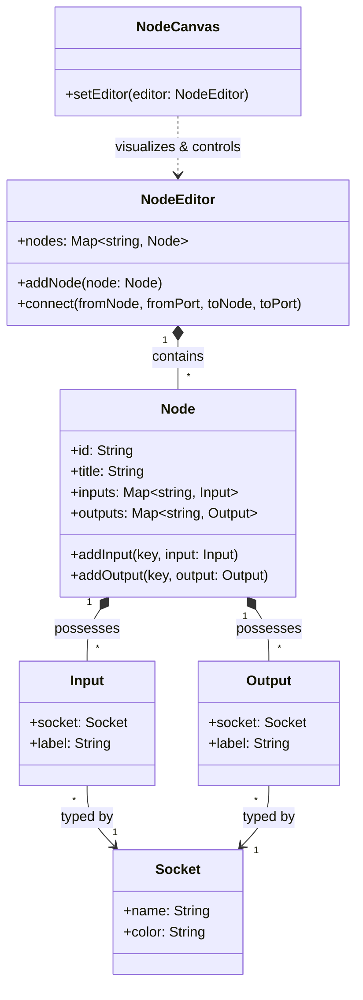

[](https://opensource.org/licenses/MIT)
[](https://nodejs.org)
[](#)
[](#)

# symbiote-node

A **visual node graph editor** and **execution engine** built on [Symbiote.js](https://github.com/symbiotejs/symbiote.js) — extensible, themeable, zero-dependency. Pure Web Components, works anywhere: vanilla HTML, React, Vue, Svelte, or any framework that supports custom elements.

> [!TIP]
> **Node-safe core, browser Web Components, and agent-readable metadata.** Clone, serve, and start building node graphs in under a minute.

---

## Table of Contents

- [Graph Editor](#graph-editor)
- [Universal Graph Model](#universal-graph-model)
- [Source Display and Editing](#source-display-and-editing)
- [List UI](#list-ui)
- [Surface UI](#surface-ui)
- [Tree UI](#tree-ui)
- [Chat UI](#chat-ui)
- [Experimental HTML-in-Canvas Renderer](#experimental-html-in-canvas-renderer)
- [Experimental WebXR Provider](#experimental-webxr-provider)
- [Shared UI Styles](#shared-ui-styles)
- [Execution Engine](#execution-engine)
- [Node Shapes](#node-shapes)
- [Theme System](#theme-system)
- [Runtime UI Registry](#runtime-ui-registry)
- [Layout System (BSP)](#layout-system-bsp)
- [Plugins & Interactions](#plugins--interactions)
- [Compatibility Matrix](#compatibility-matrix)
- [Installation](#installation)
- [Quick Start](#quick-start)
- [As ES Module (CDN)](#as-es-module-cdn)
- [CLI (Engine)](#cli-engine)
- [Agent Provider Contract](#agent-provider-contract)
- [Engine Handlers](#engine-handlers)
- [Project Structure](#project-structure)
- [Tests](#tests)
- [Related Projects](#related-projects)
- [License](#license)

---

## Compatibility Matrix

`symbiote-node` is designed to be highly compatible across modern browser environments and server-side runtime setups.

| Environment | Supported Version / Status | Notes |
|-------------|----------------------------|-------|
| **Node.js** | `>= 18.0.0` | Required for topological engine execution and CLI tool |
| **Browsers** | Modern evergreen browsers (Chrome, Safari, Firefox, Edge) | Native custom elements, CSS custom properties, and SVG rendering |
| **SSR / Server Rendering** | Full isomorphic safety (Next.js, Nuxt, SvelteKit, etc.) | Core classes run on server; UI components are inert until browser hydration |
| **Symbiote.js** | `>= 3.0.0` | Peer dependency for reactive custom elements |

---

### Graph Editor

The editor constructs visual node graphs from a data model. Nodes have typed input/output ports with compatibility validation, color-coded category headers, inline controls, and drag & drop with snap-to-grid. Connections render as SVG Bézier curves with gradient coloring.

```javascript
import { NodeEditor, Node, Socket, Input, Output } from 'symbiote-node';
import { NodeCanvas } from 'symbiote-node/ui';

const editor = new NodeEditor();
const socket = new Socket('data', { color: '#4a9eff' });

const node1 = new Node('Source', { category: 'server' });
node1.addOutput('out', new Output(socket, 'Output'));

const node2 = new Node('Target', { category: 'control' });
node2.addInput('in', new Input(socket, 'Input'));

editor.addNode(node1);
editor.addNode(node2);

const canvas = document.querySelector('node-canvas');
canvas.setEditor(editor);
```

### Core Architecture Relationship



The root `symbiote-node` entrypoint is Node-safe and does not register browser custom elements. Browser UI modules live in `symbiote-node/ui`; in SSR or pure Node imports, browser-only exports are present but resolve to `undefined` until DOM globals are available.

### Universal Graph Model

`symbiote-node/graph` exposes Node-safe graph normalization for project data, UI layouts, automation workflows, media pipelines, and external node-workflow formats. `graph-model-v1` keeps node flow, params, design, hierarchy, state, views, and theme references as separate data domains so host apps and agents can project the same model into editors, dashboards, runtime execution, or custom layouts without product-specific fields.

```javascript
import { graphModelToCanvasGraphModel, normalizeGraphModel } from 'symbiote-node/graph';

const model = normalizeGraphModel({
  version: 'graph-model-v1',
  nodes: [
    {
      id: 'panel:queue',
      kind: 'ui.panel',
      params: { source: 'automation.queue' },
      design: { component: 'sn-list-item', themeScope: 'panel.queue' },
    },
  ],
});

const canvasModel = graphModelToCanvasGraphModel(model, { view: 'main' });
```

`project-package-v1` wraps those graphs with layouts, themes, packs, data sources, and agent rules. A host application can load a package config and choose the entry graph, layout, and theme without hardcoding a product shell. Built-in provider themes validate modifier names against the published theme controls so agent-authored packages cannot silently invent unsupported theme knobs.

`project-transaction-v1` describes safe agent-authored mutations such as adding graph nodes, connecting edges, adding runtime panels, replacing a layout root, or setting a theme modifier. Hosts can apply those transactions to project packages and re-render without restarting the application.

`createProjectRuntime(project)` wraps a normalized project package with a small subscription-based host state. It applies `project-transaction-v1` updates, exposes the active graph/layout/theme records, and rejects transactions targeting a different project. Product apps remain responsible for persistence, permissions, and route policy.

Canvas adapters bridge the universal graph contract to the existing `CanvasGraph` model shape. They are generic: product skeletons, route state, code-analysis metadata, and server policy stay in the host or provider layer.

### Source Display And Editing

`CodeBlock`, `SourceViewer`, and `SourceEditor` are reusable browser-only modules from `symbiote-node/ui`. Host applications provide file loading and persistence; the library owns rendering, markdown/code display, editable source text state, dirty state, readonly/disabled behavior, focus helpers, and tab insertion.

```javascript
import { SourceEditor, SourceViewer } from 'symbiote-node/ui';

const editor = document.querySelector('source-editor');
editor.setContent('# Notes');
editor.addEventListener('source-editor-input', (event) => {
  saveDraft(event.detail.value);
});

const viewer = document.querySelector('source-viewer');
viewer.showFile({ path: 'README.md', raw: editor.getContent(), lang: 'md' });
```

### List UI

`ListItem` is a generic browser-only list primitive from `symbiote-node/ui`. It owns neutral item presentation, active/disabled state, keyboard selection, and the `sn-list-item-select` event; host applications decide routing, persistence, and item-specific actions.
`ListDetailShell` is a generic two-pane list/detail shell. It owns split geometry, responsive stacking, empty/detail visibility, and theme aliases; host applications provide list rows, detail content, loading states, commands, and selection policy through slots.

```javascript
import { ListDetailShell, ListItem } from 'symbiote-node/ui';

const item = document.querySelector('sn-list-item');
item.setItem({
  label: 'Build',
  description: 'Run the default build task',
  icon: 'play_arrow',
  meta: 'local',
  active: false,
});

item.addEventListener('sn-list-item-select', (event) => {
  runItem(event.detail.item);
});

document.querySelector('sn-list-detail-shell').hasDetail = true;
```

### Surface UI

`SurfaceCard`, `ActionButton`, `FormField`, `StatusBadge`, `MetricItem`, `StatusBanner`, and `EmptyState` are generic browser-only composition primitives from `symbiote-node/ui`. They own the standard card background, border, radius, spacing, action control variants, form label/control geometry, compact status label variants, label/value metric rows, inline status feedback, empty placeholder layout, keyboard activation, and interactive hover/focus states. Host applications keep content, native input data, validation, status mapping, and command policy product-specific.

```javascript
import { ActionButton, EmptyState, FormField, MetricItem, StatusBadge, StatusBanner, SurfaceCard } from 'symbiote-node/ui';

document.body.innerHTML = `
  <sn-card interactive>
    <span slot="title">Runtime</span>
    <sn-field>
      <label>Filter</label>
      <input type="search" placeholder="Search instances">
    </sn-field>
    <p>3 active instances</p>
    <sn-badge variant="success">Connected</sn-badge>
    <sn-metric><span slot="label">Latency</span><span slot="value">42ms</span></sn-metric>
    <sn-banner variant="info">Runtime status updated</sn-banner>
    <sn-empty-state>No archived instances</sn-empty-state>
    <sn-button slot="footer" variant="primary">Refresh</sn-button>
  </sn-card>
`;
```

### Tree UI

`TreeView` is a generic browser-only tree primitive from `symbiote-node/ui`. It owns neutral tree rendering, selection, expansion state, branch-aware filtering, optional expanded-state persistence, and drag payload events. `TreePanel` wraps that primitive with standard filter, collapse, and placeholder chrome for application sidebars. Host applications provide data, routing, file loading, and persistence policy.

```javascript
import { TreePanel, TreeView } from 'symbiote-node/ui';

const tree = document.querySelector('sn-tree-view');
const panel = document.querySelector('sn-tree-panel');

tree.setItems([
  {
    id: 'src',
    label: 'src',
    kind: 'folder',
    icon: 'folder',
    path: '/src',
    children: [
      {
        id: 'src-app',
        label: 'app.js',
        kind: 'file',
        icon: 'code',
        path: '/src/app.js',
        badges: ['js'],
        draggable: true,
        payload: { path: '/src/app.js' },
      },
    ],
  },
]);

tree.expandedIds = ['src'];
tree.filterText = 'app';
tree.addEventListener('sn-tree-select', (event) => {
  openItem(event.detail.item);
});

panel.setItems(tree.items);
panel.addEventListener('sn-tree-panel-filter', (event) => {
  saveFilterPreference(event.detail.filterText);
});
```

### Chat UI

Reusable chat primitives are browser-only exports from `symbiote-node/ui`. `ChatTranscript` owns transcript rendering, scroll controls, live status, copy feedback, and delegation-card events. `ChatComposer` owns the textarea, context chips, footer controls, send/stop affordance, drag/drop host, and autocomplete container. `ChatList` and `ChatListItem` own reusable chat-list display, filters, nesting, selection, creation, and delete events. Host applications keep transport, routing, persistence, autocomplete data, and model/provider policy.

```javascript
import { ChatComposer, ChatList, ChatTranscript, buildChatMessageItems } from 'symbiote-node/ui';

const transcript = document.querySelector('chat-transcript');
const { items } = buildChatMessageItems(messages, { hasActiveStream: true });

transcript.setMessageItems(items);
transcript.addEventListener('delegation-card-open', (event) => {
  openChat(event.detail.chatId);
});

const composer = document.querySelector('chat-composer');
composer.setFooterHtml(providerControlsHtml);
composer.addEventListener('chat-composer-submit', () => sendMessage(composer.getInputElement().value));

const list = document.querySelector('chat-list');
list.setItems(chatItems);
list.addEventListener('chat-list-select', (event) => openChat(event.detail.id));
```

### Experimental HTML-in-Canvas Renderer

`symbiote-node/ui` exposes an experimental HTML-in-Canvas adapter for packaged Chromium hosts and origin-trial browsers. It feature-detects `drawElementImage`, `captureElementImage`, `texElementImage2D`, `copyElementImageToTexture`, `requestPaint`, OffscreenCanvas support, paint changed-elements data, and the `layoutsubtree` canvas setup before rendering, and keeps `dom-overlay` as the fallback path when the browser does not support the API.

```javascript
import {
  createHtmlInCanvasAdapter,
  setupHtmlInCanvas,
} from 'symbiote-node/ui';

let adapter = createHtmlInCanvasAdapter();
if (adapter.canRender('canvas2d')) {
  setupHtmlInCanvas(canvas);
  canvas.addEventListener('paint', () => {
    adapter.draw2d(ctx, element, { x: 0, y: 0 });
  });
}
```

Hosts should keep this renderer behind capability checks. The default browser path remains regular Web Components and DOM overlays until the platform API is stable across target runtimes.

### Experimental WebXR Provider

`symbiote-node/xr` exposes Node-safe WebXR provider helpers for host applications that want to place project layouts in immersive browser sessions. The provider does not depend on Three.js, Babylon, PlayCanvas, or Agent Portal; it owns capability detection, session wrappers, spatial panel projection, and pointer normalization.

```javascript
import {
  createXRHtmlCanvasRenderer,
  createXRPanelHost,
  createXRPanelContentViewport,
  createXRPanelGeometrySummary,
  createXRSceneController,
  createXRSpatialScene,
  createXRThemeSnapshot,
  hitTestXRPanels,
  createXRPointerEvent,
} from 'symbiote-node/xr';

let scene = createXRSpatialScene(layoutTree, {
  themeScope: 'section.graph',
  userSpace: { eyeHeight: 1.62, comfortRadius: 2 },
});
let themeSnapshot = createXRThemeSnapshot(document.documentElement, {
  themeScope: scene.themeScope,
});
let controller = createXRSceneController();
let host = createXRPanelHost({
  componentResolver: (name) => name,
});
let renderer = createXRHtmlCanvasRenderer();

controller.setScene(scene, { themeSnapshot });
host.setScene(scene, { themeSnapshot });
await controller.start('immersive-vr', { optionalFeatures: ['local-floor', 'hand-tracking'] });

for (let panel of scene.panels) {
  let element = host.mountPanel(panel, document.createElement('div'));
  renderer.preparePanel(element, panel);
  let viewport = createXRPanelContentViewport(panel);
  let summary = createXRPanelGeometrySummary(panel);
  console.log(summary.sizeSource, summary.relativeRect, summary.meters, viewport);
}

let hit = hitTestXRPanels(controllerRay, scene.panels);
let event = createXRPointerEvent(hit, { source: 'xr-controller', primary: true }, 'click');
```

Host apps remain responsible for renderer choice. A Quest-style browser host can render projected live DOM panels as WebGL/WebGPU textures through the HTML-in-Canvas adapter, or fall back to DOM overlays while keeping the same layout, session lifecycle, theme snapshot, and pointer contracts. XR material aliases such as `--sn-xr-panel-bg` and `--sn-xr-pointer-color` derive from the default provider theme instead of defining a separate XR palette.

XR panel size is derived from relative layout data before projection. `LayoutTree` split ratios and runtime UI `layout.weight` / `layout.rect` values normalize into panel `relativeRect` data, then into meter-based `size`. An explicit `xr.size` still wins when a host or agent needs a deliberate override. `createXRPanelContentViewport(panel, options)` keeps live DOM panels at usable internal pixel dimensions before texture or fallback scaling. `createXRPanelGeometrySummary(panel, preview)` returns data-only diagnostics for hosts that need to show the source size, normalized rectangle, meter size, preview pixels, content viewport, position, and rotation without reimplementing projection logic.

Open `demo/spatial-layout.html` to inspect the non-immersive fallback preview. It uses the same human-space scene and pointer hit-test contracts that a headset renderer would consume.

### Shared UI Styles

`sharedUiStyles` is the reusable class recipe layer for browser components that need standard panel shells, buttons, cards, forms, lists, badges, banners, and empty states. The module is a plain string export from `symbiote-node/ui`, backed by `--sn-*` design tokens, and is safe to import without DOM globals.

```javascript
import { sharedUiStyles } from 'symbiote-node/ui';
import panelStyles from './my-panel.css.js';

MyPanel.rootStyles = sharedUiStyles + panelStyles;
```

`uiAlert`, `uiConfirm`, and `uiPrompt` provide light DOM dialog helpers with scoped `sn-dialog-*` styles and escaped message/default text.

```javascript
import { uiConfirm } from 'symbiote-node/ui';

if (await uiConfirm('Delete this item?')) {
  deleteItem();
}
```

### Execution Engine

Server-side graph runtime with custom handler loading. Graphs serialize to JSON and execute with topological ordering, retry logic, and parallel barriers.

```javascript
import { Graph, Executor, loadHandlers } from 'symbiote-node/engine';

await loadHandlers('./handlers');

const graph = new Graph({
  version: 'v1',
  nodes: [
    { id: 'source', type: 'compound/input', params: { value: 'hello' } },
    { id: 'result', type: 'compound/output', params: {} }
  ],
  connections: [
    { from: 'source', out: 'data', to: 'result', in: 'data' }
  ]
});

const executor = new Executor();
const results = await executor.run(graph);
```

### Node Shapes

Two coexisting rendering modes on the same canvas — **HTML nodes** (CSS-styled rectangles) and **SVG nodes** (arbitrary vector shapes with perimeter-aware connector positioning). Built-in presets: `hexagon`, `star`, `cloud`, `shield`, `heart`, `rect`, `pill`, `circle`, `diamond`, `comment`.

```javascript
import { createSVGShape, registerShape } from 'symbiote-node';

const myShape = createSVGShape('myshape', 'M12 2L22 8V16L12 22L2 16V8Z');
registerShape('myshape', myShape);

const node = new Node('Custom', { shape: 'myshape' });
```

### Theme System

Separate **Palette** (colors), **Skin** (geometry), and **Theme** (combined) layers — all driven by CSS custom properties. Apply the active theme once at the app shell or subtree owner; components inherit tokens through the normal cascade.

| Theme | Description |
|-------|-------------|
| `DEFAULT_PROVIDER_THEME` / `DEFAULT_THEME` | Cascadeable provider default aligned with the current Agent Portal shell; parameterized by source controls rather than locked to a dark/light mode |
| `DEFAULT_DARK` | Backward-compatible name for the current provider default preset |
| `GREY_NEUTRAL` | Balanced grey UI |
| `DARK_DEFAULT` | Professional dark interface |
| `LIGHT_CLEAN` | Light mode |
| `SYNTHWAVE` | Neon retro aesthetic |
| `NEON_GLOW` | Vivid glow effects |
| `CARBON` | IBM Carbon-inspired |
| `EBOOK` | Warm paper-like reading theme |

```javascript
import { applyTheme, DEFAULT_PROVIDER_THEME, applyPalette, SYNTHWAVE_PALETTE } from 'symbiote-node/ui';

applyTheme(appShellElement, DEFAULT_PROVIDER_THEME); // Full provider theme
applyPalette(canvasElement, SYNTHWAVE_PALETTE); // Colors only
```

For first paint before JavaScript applies a runtime theme, host shells can load the static provider defaults:

```html
<link rel="stylesheet" href="/packages/symbiote-node/themes/default-provider.css">
```

Agent-readable theme construction data is published through `symbiote-node/manifest` and `node engine/cli.js discover`. The default provider theme is a cascadeable neutral default aligned with the current Agent Portal shell, but exposed as provider-neutral `--sn-*` tokens rather than product CSS. It is described as composable rule blocks: source accents, color cascade, geometry cascade, typography cascade, motion/effects, semantic aliases, and component aliases. Each block exposes inputs, outputs, parameters, and derivations so agents can compose new themes from root accents and density rules instead of writing one-off component overrides. Runtime component tokens for graph nodes, tree rows, project tabs, sidebars, chat composer controls, status chips, message events, shadows, and interaction states are part of `DEFAULT_PROVIDER_THEME`; public components consume those tokens through the CSS cascade instead of shipping local fallback themes.

Theme modifiers are project data, not product code. For the default provider theme, supported controls are `hue`, `chroma`, `backgroundLightness`, `surfaceLightness`, `textLightness`, `density`, `radius`, `motion`, and `elevation`; custom theme packs can define their own modifier vocabulary.

### Runtime UI Registry

Host applications and agents should resolve browser UI modules through the `symbiote-node/ui` runtime registry. The registry is backed by the public component catalog and already imported UI classes; consumers do not need component deep imports or manual `customElements` glue.

```javascript
import {
  defineModule,
  getModule,
  listModules,
  registerModule,
} from 'symbiote-node/ui';

const publicModules = listModules();
const ChatTranscript = getModule('chat-transcript');

defineModule('chat-transcript'); // idempotent when the element already exists

class HostPanel extends HTMLElement {}
registerModule('host-panel', HostPanel);
defineModule('host-panel');
```

`listModules()` returns public modules by default. Internal components are hidden unless a host explicitly passes `{ includeInternal: true }`, so agents can distinguish reusable provider primitives from implementation-only child elements.

### Layout System (BSP)

Binary Space Partitioning layout engine for IDE-style panel workspaces. Panels resize by dragging dividers, sections split horizontally or vertically. Sidebar navigation with section switching and panel routing.

```javascript
import { Layout, LayoutTree, LayoutSidebar } from 'symbiote-node/ui';
```

For library consumers that only need layout tree and section registry primitives, use the lighter `symbiote-node/layout` entrypoint. It exposes pure layout helpers without requiring DOM globals or graph editor modules:

```javascript
import {
  LayoutTree,
  createSectionRegistry,
  withGlobalPanel,
} from 'symbiote-node/layout';

const registry = createSectionRegistry();

registry.registerSection('explorer', {
  icon: 'folder',
  label: 'Explorer',
  scope: 'project',
  layout: withGlobalPanel(
    () => LayoutTree.createSplit(
      'horizontal',
      LayoutTree.createPanel('file-tree'),
      LayoutTree.createPanel('code-viewer'),
      0.35
    ),
    'agent-chat',
    { collapsed: true }
  ),
});

const tree = registry.getLayout('explorer');
const primaryPanel = LayoutTree.getPrimaryPanelType(tree);
const sidebarItems = LayoutTree.createSidebarSubPanels(tree, {
  'file-tree': { title: 'Files', icon: 'folder' },
  'code-viewer': { title: 'Code', icon: 'code' },
});
```

`LayoutTree` helpers use canonical BSP nodes (`type`, `first`, `second`) so host shells can serialize and inspect layouts through one stable shape.

The same `symbiote-node/layout` entrypoint also exposes URL-backed routing helpers for host shells and panels. In Node/SSR imports these helpers are safe to import; URL mutating functions are no-ops until browser globals exist.

```javascript
import { navigate, parseQuery, setupPanelRouting } from 'symbiote-node/layout';

navigate('skills', 'agents/orchestrator.md', { project: 'workspace-1' });

setupPanelRouting(panelElement, 'skills', {
  tabs: ['team', 'open-library'],
  syncParams: { filter: { param: 'q', default: '' } },
});

const params = parseQuery('project=workspace-1&tab=team');
```

### Plugins & Interactions

- **History** — undo/redo with keyboard bindings (Ctrl+Z / Ctrl+Shift+Z)
- **Readonly** — toggle read-only mode, blocks all mutations
- **FlowSimulator** — topological sort-based data flow animation with marching ants
- **SnapGrid** — configurable grid snapping
- **Selector** — rubber-band multi-select
- **ConnectFlow** — socket highlighting during connection drag
- **AutoLayout** — Sugiyama-based automatic node arrangement
- **Minimap** — viewport minimap with live position tracking
- **NodeSearch** — search/omnibox for quick node insertion
- **GraphTabs** — multi-page graph management
- **Subgraphs** — drill-down with breadcrumb navigation
- **Portals** — named reroutes for cross-graph connections
- **InspectorPanel** — property inspector sidebar
- **QuickToolbar** — floating action toolbar above selected node

## Installation

Install `symbiote-node` via your preferred package manager. Note that `@symbiotejs/symbiote` is required as a peer dependency.

### Using npm
```bash
npm install symbiote-node @symbiotejs/symbiote
```

### Using yarn
```bash
yarn add symbiote-node @symbiotejs/symbiote
```

### Using pnpm
```bash
pnpm add symbiote-node @symbiotejs/symbiote
```

## Quick Start

```bash
git clone https://github.com/RND-PRO/symbiote-node.git
cd symbiote-node
npx -y serve -l 3000 .
# Open http://localhost:3000/demo/
```

### As ES Module (CDN)

```html
<script type="importmap">
{
  "imports": {
    "@symbiotejs/symbiote": "https://esm.sh/@symbiotejs/symbiote@3.2.1",
    "symbiote-node": "./index.js",
    "symbiote-node/ui": "./ui/index.js",
    "symbiote-node/layout": "./layout/index.js",
    "symbiote-node/xr": "./xr/index.js"
  }
}
</script>
<script type="module">
  import { NodeEditor, Node, Socket, Input, Output } from 'symbiote-node';
  import { NodeCanvas } from 'symbiote-node/ui';
  // ...
</script>
```

## CLI (Engine)

```bash
symbiote-node run <workflow.json>       # Execute graph
symbiote-node validate <workflow.json>  # Validate graph
symbiote-node list                      # List available node types
symbiote-node inspect <workflow.json>   # Inspect graph structure
symbiote-node discover                  # Output agent-readable package metadata
```

Use `--json` with `run`, `validate`, `list`, and `inspect` when integrating with agents or CI.

## Agent Provider Contract

`symbiote-node` publishes machine-readable provider metadata for agents:

- `custom-elements.json` — Web Component catalog
- `manifest/` — components, themes, rules, and graph schema accessors
- `symbiote-node/graph` — Node-safe `graph-model-v1` normalizers for shared project/workflow/UI graph data
- `symbiote-node/xr` — WebXR capability, spatial layout projection, and XR pointer contracts
- `schemas/project-package-v1.json` — portable project config contract for graph/layout/theme/packs assembly
- `schemas/project-transaction-v1.json` — safe mutation contract for agent-built UI and workflow changes
- `symbiote-node/ui` — browser Web Components, router helpers, chat primitives, and shared UI styles
- `tokens/` — design token and theme JSON files
- `rules/` — Symbiote.js and library boundary rules
- `schemas/` — graph JSON schemas
- `node engine/cli.js discover` — one JSON payload for component, theme, rule, token, schema, and export discovery

Theme recipes are available through `getThemeRecipe(name)` from `symbiote-node/manifest` and through `discover.manifest.themeRecipes`. A recipe combines theme metadata, the theme file, DTCG token tree, flattened token paths, runtime CSS custom properties, parametric controls, element groups, and rule blocks so agents can build or modify themes from explicit source accents, cascade formulas, semantic aliases, and component aliases. The default provider theme exposes native CSS controls such as `--sn-theme-hue`, `--sn-theme-chroma`, `--sn-theme-density`, `--sn-theme-radius-scale`, `--sn-theme-motion-scale`, and `--sn-theme-elevation-scale`; host apps can override those at `:root` or any subtree boundary without per-component style patches. HSL/alpha-HSL and `color-mix()` aliases, geometry tokens, and control tokens are part of the manifest recipe and DTCG token file. Themeable library CSS should reference `--sn-*` tokens directly and rely on `DEFAULT_PROVIDER_THEME` for defaults; raw component colors or geometry belong in `themes/default-dark.js`, `tokens/themes/default-dark.json`, and the theme catalog.

## Engine Handlers

Custom handlers can be loaded from any directory with `loadHandlers()`. Handler files use the `*.handler.js` convention and are registered as node types at runtime. Provider-specific automation packs are intentionally not part of the public package surface.

## Project Structure

```
symbiote-node/
├── index.js          — Node-safe public API
├── ui/               — browser/UI entrypoint for custom elements
├── graph/            — universal graph model normalization
├── manifest/         — agent-readable catalogs
├── tokens/           — design token JSON
├── rules/            — machine-readable rules
├── schemas/          — graph schemas
├── core/             — Editor, Node, Connection, Socket, Portal
├── canvas/           — NodeCanvas, ConnectionRenderer, FlowSimulator, AutoLayout
├── node/             — GraphNode, PortItem, CtrlItem, NodeSocket
├── menu/             — ContextMenu
├── interactions/     — Drag, Zoom, Selector, SnapGrid, ConnectFlow
├── display/          — CodeBlock, SourceViewer, SourceEditor, markdown formatting
├── shapes/           — SVG shape system with 10 presets
├── themes/           — Theme, Palette, Skin, and built-in theme definitions
├── layout/           — BSP layout engine + LayoutSidebar + LayoutRouter
├── toolbar/          — QuickToolbar
├── inspector/        — InspectorPanel
├── palette/          — PaletteBrowser
├── plugins/          — Readonly, History
├── engine/           — Server-side graph runtime and CLI runner
├── demo/             — Interactive demo
└── tests/            — Node test suites for package contracts and behavior
```

## Tests

```bash
node --test tests/*.test.js
```

## Related Projects

- [Symbiote.js](https://github.com/symbiotejs/symbiote.js) — Isomorphic Reactive Web Components framework

## License

MIT © [RND-PRO.com](https://rnd-pro.com)

---

**Made with ❤️ by the RND-PRO team**
